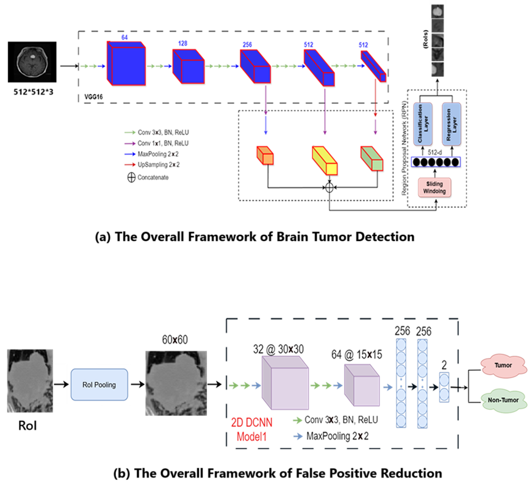

<!-- This is an html comment and this won't appear in the rendered page. You are now editing the "content" area, the core of your description. Everything that you can do in markdown is allowed below. We added a couple of comments to guide your through documenting your progress. -->
---

<a href="https://github.com/Amirzamani4096">
   
    <b>Yadollah (Amir) Zamanidoost.</b>
</a>

I'm Yadollah (Amir) Zamanidoost, a PhD student in Computer Engineering at Polytechnique Montréal. My research focuses on early-stage lung cancer detection using deep learning techniques on CT scan images. I’m passionate about applying AI in healthcare and excited to expand my skills in neural data science. I joined Brainhack School to learn new tools, collaborate with others, and explore how open science practices can support impactful research.

---
# Brian Tumor Detection in MRI Using Faster R-CNN

## Project definition

The goal of this project is to develop an automated and accurate brain tumor detection system using deep learning techniques. Leveraging the power of Faster R-CNN, the model detects tumors in MRI images by learning spatial features and distinguishing abnormal regions from healthy tissue. This tool is designed to assist radiologists by reducing diagnostic time and minimizing false positives.

### Background
Brain tumors are among the most challenging medical conditions to detect and treat. Accurate identification of tumor regions in MRI scans is crucial for diagnosis, surgical planning, and treatment monitoring. Traditional methods rely heavily on expert interpretation, which can be time-consuming and prone to inter-observer variability. Deep learning approaches, especially object detection frameworks like Faster R-CNN, offer a promising alternative by automating tumor localization and classification. In this project, we enhance the classical Faster R-CNN pipeline with a false positive reduction (FPR) stage to improve robustness and reliability.

### Objective

The main objective of this project is to accurately detect brain tumors in MRI scans using the Faster R-CNN object detection framework. By leveraging deep convolutional neural networks, this project aims to enhance early diagnosis and assist medical professionals in identifying tumor regions with high precision.

### Tools

- **Programming Language**: Python 3.x  
- **Deep Learning Framework**: PyTorch  
- **Computer Vision Libraries**: OpenCV, torchvision  
- **Annotation Tool**: LabelImg, nibabel 
- **Visualization**: Matplotlib, Seaborn  
- **Notebook Environment**: Jupyter Notebook  
- **Hardware**:
  - **Training RPN**: Tesla V100 GPU (via terminal-based access)
  - **Inference and Evaluation**: CPU
- **CUDA**: Used during RPN training for GPU acceleration  

### Data

This project uses publicly available datasets containing 2D T1-weighted contrast-enhanced MRI images of brain tumors along with their ground-truth labels. The data is sufficient in both quantity and quality to allow for effective training and fine-tuning of object detection models such as Faster R-CNN.

1. [Brain Tumor Segmentation @ Kaggle](https://www.kaggle.com/datasets/nikhilroxtomar/brain-tumor-segmentation)  
   - **Original Source & Credit**: [Figshare](https://figshare.com/articles/dataset/brain_tumor_dataset/1512427)  
   - **Description**: This dataset contains 3064 T1-weighted contrast-enhanced brain MRI images in `.png` format, with manually labeled tumor regions provided via ground-truth masks.  
   - **Use Case**: Used for training and fine-tuning the Faster R-CNN model.

All images were preprocessed and annotated for object detection tasks by converting segmentation masks into bounding box labels.
